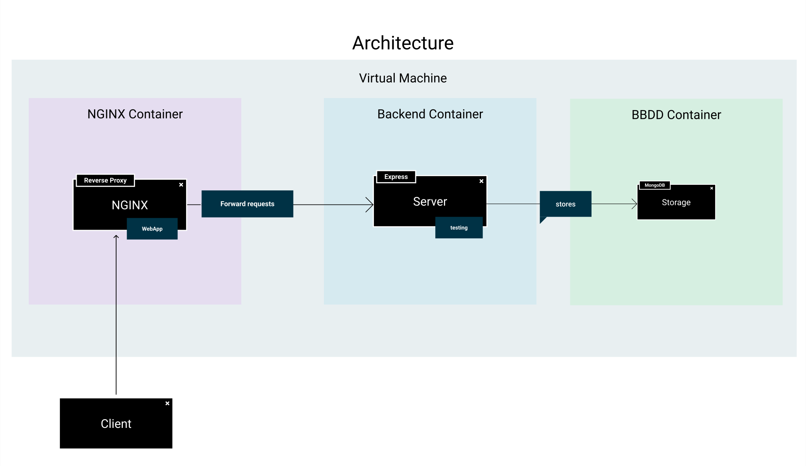

# Proyecto Web - Containerization

## Documentación

Puedes encontrar la documentación de este proyecto en [este enlace](https://taller-threepoints-docs.netlify.app/docs/containers-orchestation/intro).

## Prototipo

Una versión interactiva del proyecto se puede encontrar en la [Página de Figma](https://www.figma.com/proto/3e43h8TrzwpjfKwXvFxZoP/Taller?page-id=144%3A51&node-id=147%3A3&viewport=254%2C48%2C0.21&scaling=min-zoom&starting-point-node-id=147%3A3).

Además, como se enseñará en el propio proyecto, podemos ver el prototipo final en [este link](https://taller-threepoints-1.netlify.app/)

## Setup

Para poner en marcha el proyecto tenemos que seguir los pasos detallados en el [CONTRIBUTING.md](CONTRIBUTING.MD)

// TODO 0: Instalar [Docker](https://docs.docker.com/get-docker/) y [Docker Compose](https://docs.docker.com/compose/install/) en nuestro equipo

// TODO 1: Crear un fichero Dockerfile para la ui dentro de la carpeta /ui. Este Dockerfile debe empezar con una [imagen node](https://hub.docker.com/_/node) y debe tener los *react scripts* instalados en la imagen, para poder después ejecutar el frontend en modo desarrollador.

// TODO 1 (HINT): RUN npm install react-scripts@4.0.3 -g

// TODO 1 (HINT): Crea un fichero .dockerignore para evitar copiar la carpeta *node_modules*

// TODO 2: Crear un fichero Dockerfile para el api dentro de la carpeta /pi. Este Dockerfile debe empezar con una [imagen node](https://hub.docker.com/_/node) y debe ejecutar el backend en modo desarrollador.

// TODO 2 (HINT): Crea un fichero .dockerignore para evitar copiar la carpeta *node_modules*.

// TODO 3: Crea el fichero docker-compose.yml que va definir los siguientes componentes:

// TODO 3: Servicio UI que va a tener expuesto el puerto 3000 y va a tener definido la variable REACT_APP_PROXY_HOST al backend en el puerto 4000

// TODO 3: Servicio API que va a depender del servicio mongodb, con el puerto 400 expuesto y conectando MONGODB_URI a *mongodb://mongodb:27017/*

// TODO 3: Un servicio Mongodb, que inicialice su base de datos con la variable de entorno MONGO_INITDB_DATABASE y que comparta el siguiente volumen: `./scripts/mongo-init.js:/docker-entrypoint-initdb.d/mongo-init.js:ro`

// TODO 4: Compilar la imagen y comprobar que el despliegue funciona ejecutando `docker-compose up --build`.

// TODO 5: Instala [Minikube](https://minikube.sigs.k8s.io/docs/start/) en tu equipo

// TODO 6: Despliega las imagenes en tu propio registry de docker, para ello crea una cuenta en [Docker](https://www.docker.com) si no la tienes, [logeate en tu ordenador con docker](https://docs.docker.com/engine/reference/commandline/login/) y sustituye la variable .`DOCKER_NAMESPACE` en el fichero *Makefile* con tu username. Ahora ejecuta `make docker-deploy`.

// TODO 7: Inicia minikube con `minikube start`, crea el nuevo namespace con `make k8s-create-ns`, despliega la infraestructura con `make k8s-deploy` y comprueba el estado con `make k8s-status`.

// TODO 8: Comprueba el estado de tu despliegue con el dashboard de kubernetes, para ello en una pestaña nueva de tu terminal ejecuta `minikube dashboard`.

// TODO 9: Accede a uno de los *pods* de nginx, para ello ejecuta `make k8s-get-service` y accede a la ip que genere minikube.
